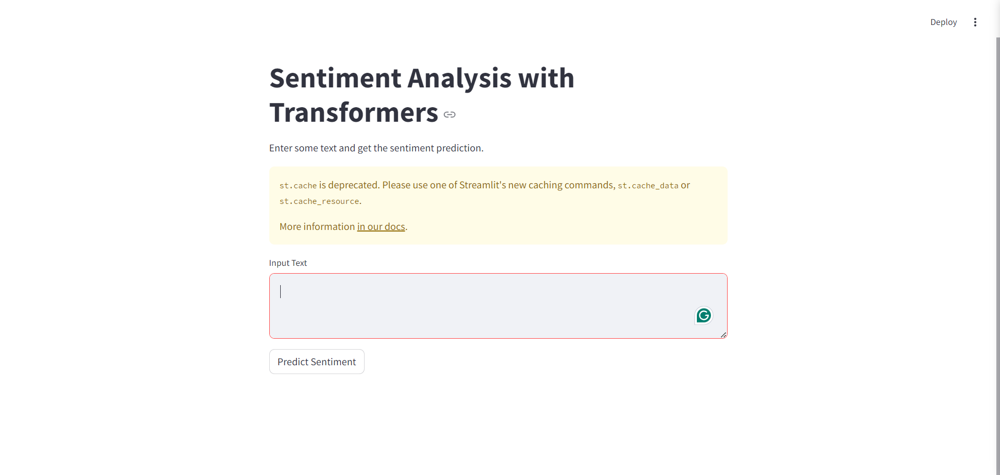

# Sentiment Analysis with BERT Model

This project provides a Streamlit web application for sentiment analysis using a pre-trained BERT model from the Hugging Face Transformers library. The model predicts the sentiment of a given text as either positive or negative.

## Table of Contents
- [Installation](#installation)
- [Usage](#usage)
- [Example Texts](#example-texts)
- [Screenshots](#screenshots)
- [Dataset Information](#dataset-information)
- [Acknowledgements](#acknowledgements)

## Installation

To run this project, you need to have Python installed. We recommend using a virtual environment to manage dependencies.

1. **Clone the repository**:
    ```sh
    git clone <repository-url>
    cd <repository-folder>
    ```

2. **Create a virtual environment**:
    ```sh
    python -m venv env
    source env/bin/activate  # On Windows, use `env\Scripts\activate`
    ```

3. **Install dependencies**:
    ```sh
    pip install -r requirements.txt
    ```

## Usage

1. **Run the Streamlit app**:
    ```sh
    streamlit run sentiment_analysis_app.py
    ```

2. **Access the app**:
    Open your web browser and go to `http://localhost:8501`.

3. **Input Text**:
    Enter text into the provided text area and click the "Predict Sentiment" button to get the sentiment prediction.

## Example Texts

Use the following sample texts to test the sentiment analysis:

1. **Positive Sentiment**:
    - "I had a wonderful experience using this product. It exceeded all my expectations!"
    - "The customer service was outstanding, and the quality of the product is top-notch."
    - "I am extremely satisfied with my purchase. Highly recommended!"

3. **Negative Sentiment**:
    - "This product is terrible. It broke within a week of use and the customer service was unhelpful."
    - "I am very disappointed with this purchase. It did not meet my expectations at all."
    - "The quality of the product is poor, and it was not worth the money."

4. **Neutral Sentiment**:
    - "The product is okay, but there are better alternatives available."
    - "It does the job, but I wouldn't go out of my way to recommend it."
    - "The experience was neither good nor bad, it was just average."

## Screenshots

### Home Page


### Prediction Example


## Dataset Information

The model used in this project (`assemblyai/distilbert-base-uncased-sst2`) is pre-trained on the Stanford Sentiment Treebank v2 (SST-2) dataset. The SST-2 dataset contains sentences from movie reviews, each labeled as either positive or negative sentiment.

- **Source**: Stanford Sentiment Treebank v2 (SST-2)
- **Task**: Binary sentiment classification (positive or negative)
- **Data**: Movie reviews from Rotten Tomatoes
- **Labels**: Positive (1) or Negative (0)

## Acknowledgements

- This project uses the [Transformers](https://github.com/huggingface/transformers) library by Hugging Face.
- The pre-trained model is provided by [AssemblyAI](https://huggingface.co/assemblyai).
- The Streamlit library is used to create the web application.
